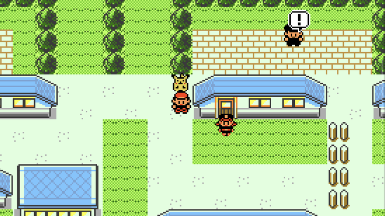
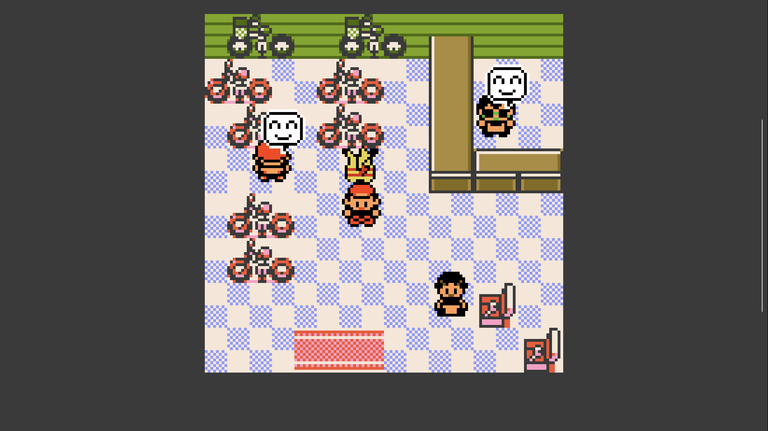

# NPC Bubbles

> This mod was coded by AI.

Puts a bubble over the NPCs who actually do something, so the person holding
a free TM does not look like the person who wants to tell you about ledges.

| Bubble | Means |
| --- | --- |
| **`!`** | talk to them and you get something, right now |
| **faded `!`** | something here later — you cannot claim it yet |
| **`?`** | talking to them changes something in the world |
| **smile** | they say different things as you progress — worth another word later |

They are the game's own bubbles — the same `!` a trainer shows when they spot
you — and they sit in the same place above the head.

Try it: walk into Viridian City and look for a `!`.

## What it does

A bubble only appears when it is true *now*. Blue's sister has nothing before
you pick a starter, shows a **`!`** once you can take the Town Map, and goes
quiet the moment you are holding it. Nothing lingers after you have taken it.

The **faded `!`** is for people who will have something for you but not yet —
Melanie before your Pikachu likes you enough, the bike shop before you have a
voucher. It turns solid when you can actually claim it.

The **smile** is for people worth another word later — they say different
things as you progress. It goes once they have nothing new left: the gym
guide loses his the moment you beat the leader, because the advice he was
offering is behind you.

Bubbles update the instant something changes, so one steps down as you finish
the conversation rather than on the next screen.

Signs get them too, where a sign has something for you: each of the Fuchsia
zoo placards shows a **`!`** until that Pokémon is in your Pokédex.

Poké Balls on the ground are left alone — they already look like what they
are. So are ordinary trainers, who announce themselves. A gym leader keeps a
**`!`** until you have both their badge and the TM they hand over afterwards.

## Options

Set these in the in-game mod manager.

| Option | Shows | Default |
| --- | --- | --- |
| `! BUBBLE` | `!` — you get something now | on |
| `FADED ! BUBBLE` | faded `!` — something here later | on |
| `? BUBBLE` | `?` — the world changes | on |
| `SMILE BUBBLE` | smile — they say new things as you progress | on |
| `CLEAR AFTER TALK` | a smile clears once you have heard what they say, and returns when they say something new | off |
| `HIDDEN BY WALLS` | hides a bubble whose NPC is behind a roof, in first and third person | off |
| `LATER FADE` | how solid the faded `!` looks | 50 |

If the smiles feel like too much, turn `SMILE BUBBLE` off first — it is the
broadest one. `CLEAR AFTER TALK` is the gentler version: instead of hiding
them all, each one goes as you hear it, and comes back if that person starts
saying something new. Only smiles are affected — a `!` never hides because
you spoke to someone.

There is also a guide in **START → OPTIONS → NPC BUBBLES** that draws the four
bubbles at the size they appear over an NPC, so you can see which is which.

## Notes

- **No bubble does not always mean nothing.** A few interactions are written
  in a way the mod cannot read; those fall back to the smile, but the cover
  is not perfect.
- **A few people say something different every time you ask** — the POKéMON
  beside the trainer in Cerulean, the chef on the S.S. ANNE. Hearing them
  once counts as hearing them, so `CLEAR AFTER TALK` does not leave their
  bubble flickering.
- **"Later" can mean much later.** Some gifts are behind badges you will not
  have for hours, so a faded `!` may sit there a long time. Turn
  `LATER BUBBLE` off if that bothers you.
- Works on Red, Blue and Yellow.

## Install

Download the `.zip` from
[Releases](https://github.com/ddagent/gen1recomp-npc-bubbles/releases) and
install it from the game: **MODS → Import mod .zip**. After that the launcher
offers **Update** whenever a new version appears.
